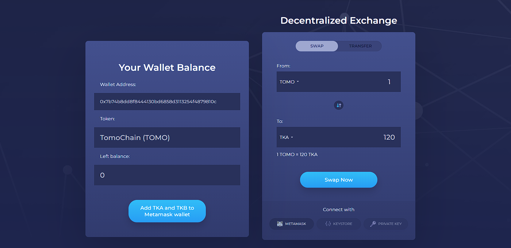

# A decentralized exchange for swapping tokens

The application is deployed to [blockchain.thaiminhpv.tech](https://blockchain.thaiminhpv.tech/) and [bdp306b.thaiminhpv.tech](https://bdp306b.thaiminhpv.tech/)



## Introduction

This project is a decentralized exchange application for swapping between Ether and ERC20 tokens.

## Installation

```bash
# nvm use 16
npm install -g npm
npm install -g truffle
npm install -g ganache-cli

cd src
npm install web3
npm install
```

Create a file called `.secret` in the root directory of the project and paste your mnemonic phrase in it.

## Development

### Local chain development

Comment out `<script src="dist/bundle.js"/>` in `index.html` and then replace with `<script src="index.js"/>`.

```bash
cd src
npm run ganache

# then open another terminal
npm run migrate
npm run design  # or npm run serve
```

### Test

```bash
truffle test
```

### Deploy

```bash
npm run build
```

Then comment out `<script src="index.js"/>` in `index.html` and replace with `<script src="dist/bundle.js"/>`.

Pushed commits to the `master` branch are automatically deployed to [blockchain.thaiminhpv.tech](https://blockchain.thaiminhpv.tech) and [bdp306b.thaiminhpv.tech](https://bdp306b.thaiminhpv.tech/) by Vercel.
